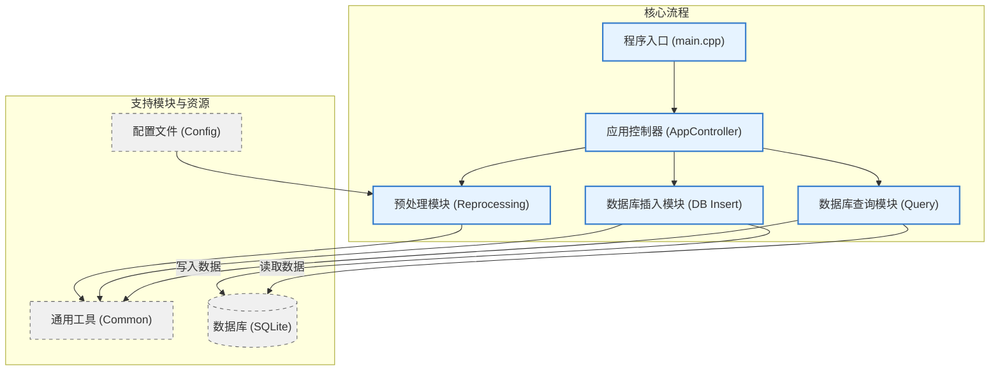

# 依赖项 (Dependencies)

本项目依赖于以下优秀的开源库：

* **[nlohmann/json](https://github.com/nlohmann/json)**
    * **用途**: 用于项目中所有 JSON 格式数据的解析和序列化（例如加载 `Validator_Config.json` 配置文件）。
    * **许可证**: MIT License

* **[SQLite C Library](https://www.sqlite.org/index.html)**
    * **用途**: C++ 部分的代码直接使用 SQLite C API 进行数据库操作，包括打开/关闭数据库连接、执行 SQL 语句、准备和绑定参数等。
    * **许可证**: Public Domain

* **[Matplotlib](https://matplotlib.org/)**
    * **用途**: 用于生成柱状图，可视化父级支出的汇总数据。
    * **许可证**: Matplotlib License (BSD-style)

# 1 Bills_Master
## 1.1 目录结构
```
Bills_Master/
├── app_controller/                       # 应用程序控制器模块
│   ├── AppController.cpp                 # 应用程序控制器的实现
│   ├── AppController.h                   # 应用程序控制器的头文件
│   └── ProcessStats.h                    # 处理统计数据结构
├── build.sh                              # 项目构建脚本
├── CMakeLists.txt                        # CMake 构建配置文件
├── common/                               # 通用工具和定义
│   ├── common_utils.h                    # 通用工具函数和宏定义 (如颜色代码)
│   └── version.h                         # 应用程序版本信息
├── config/                               # 配置文件目录
│   ├── Modifier_Config.json              # 账单修改器的配置
│   └── Validator_Config.json             # 账单验证器的配置
├── db_insert/                            # 数据库插入模块
│   ├── DataProcessor.cpp                 # 数据处理器的实现 (解析并插入)
│   ├── DataProcessor.h                   # 数据处理器的头文件
│   ├── insertor/                         # 数据库插入器
│   │   ├── BillInserter.cpp              # 账单插入器的实现
│   │   └── BillInserter.h                # 账单插入器的头文件
│   └── parser/                           # 账单解析器
│       ├── BillParser.cpp                # 账单解析器的实现
│       └── BillParser.h                  # 账单解析器的头文件
├── file_handler/                         # 文件处理模块
│   ├── FileHandler.cpp                   # 文件处理器的实现
│   └── FileHandler.h                     # 文件处理器的头文件
├── main.cpp                              # 交互式菜单主程序
├── main_commond.cpp                      # 命令行接口主程序
├── query/                                # 查询和报告模块
│   ├── export/                           # 报告导出器
│   │   ├── ReportExporter.cpp            # 报告导出器的实现
│   │   └── ReportExporter.h              # 报告导出器的头文件
│   ├── month/                            # 月度报告相关文件
│   │   ├── _month_data/                  # 月度数据结构
│   │   │   └── ReportData.h              # 月度报告数据结构定义
│   │   ├── _month_format/                # 月度报告格式化器
│   │   │   ├── LatexReportFormatter.cpp  # LaTeX 月度报告格式化器实现
│   │   │   ├── LatexReportFormatter.h    # LaTeX 月度报告格式化器头文件
│   │   │   ├── ReportFormatter.cpp       # Markdown 月度报告格式化器实现
│   │   │   ├── ReportFormatter.h         # Markdown 月度报告格式化器头文件 (通用基类或默认)
│   │   │   ├── TypstReportFormatter.cpp  # Typst 月度报告格式化器实现
│   │   │   └── TypstReportFormatter.h    # Typst 月度报告格式化器头文件
│   │   ├── _month_query/                 # 月度查询器
│   │   │   ├── TransactionReader.cpp     # 交易数据读取器实现
│   │   │   └── TransactionReader.h       # 交易数据读取器头文件
│   │   ├── MonthlyReportGenerator.cpp    # 月度报告生成器实现
│   │   └── MonthlyReportGenerator.h      # 月度报告生成器头文件
│   ├── QueryDb.cpp                       # 数据库查询门面实现
│   ├── QueryDb.h                         # 数据库查询门面头文件
│   ├── ReportFormat.h                    # 报告格式枚举定义
│   ├── year/                             # 年度报告相关文件
│   │   ├── _year_data/                   # 年度数据结构
│   │   │   └── YearlyReportData.h        # 年度报告数据结构定义
│   │   ├── _year_format/                 # 年度报告格式化器
│   │   │   ├── LatexYearlyReportFormatter.cpp # LaTeX 年度报告格式化器实现
│   │   │   ├── LatexYearlyReportFormatter.h   # LaTeX 年度报告格式化器头文件
│   │   │   ├── TypstYearlyReportFormatter.cpp # Typst 年度报告格式化器实现
│   │   │   ├── TypstYearlyReportFormatter.h   # Typst 年度报告格式化器头文件
│   │   │   ├── YearlyReportFormatter.cpp      # Markdown 年度报告格式化器实现
│   │   │   └── YearlyReportFormatter.h        # Markdown 年度报告格式化器头文件 (通用基类或默认)
│   │   ├── _year_query/                  # 年度查询器
│   │   │   ├── YearlyDataReader.cpp      # 年度数据读取器实现
│   │   │   └── YearlyDataReader.h        # 年度数据读取器头文件
│   │   ├── YearlyReportGenerator.cpp     # 年度报告生成器实现
│   │   └── YearlyReportGenerator.h       # 年度报告生成器头文件
└── reprocessing/                         # 预处理模块 (验证和修改)
    ├── modifier/                         # 账单修改器
    │   ├── BillModifier.cpp              # 账单修改器的实现
    │   └── BillModifier.h                # 账单修改器的头文件
    ├── Reprocessor.cpp                   # 预处理器的实现 (封装验证和修改)
    ├── Reprocessor.h                     # 预处理器的头文件
    └── validator/                        # 账单验证器
        ├── BillValidator.cpp             # 账单验证器的实现
        └── BillValidator.h               # 账单验证器的头文件
```
## 1.2 架构图
### 1.2.1 整体


# 2 graph
## Configuration

The script reads its configuration from a `generate_report.json` file. If this file is not found or is invalid, default settings will be used.

### generate_report.json` Example:


```
{
  "font_sizes": {
    "title": 20,
    "axis_label": 14,
    "tick_label": 12,
    "bar_label": 10
  }
}
```
font_sizes: An object containing font size settings for different chart components:

title: Font size for the main chart title.主图表标题的字体大小。

axis_label: Font size for the X and Y axis labels.X 轴和 Y 轴标签的字体大小。

tick_label: Font size for the axis tick labels.坐标轴刻度标签的字体大小。

bar_label: Font size for the labels displayed on each bar (amount and percentage).显示在每个条形上的标签（金额和百分比）的字体大小。

