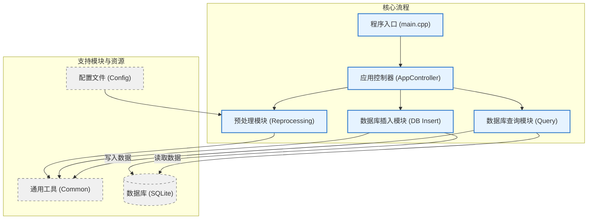

# 依赖项 (Dependencies)

本项目依赖于以下优秀的开源库：

* **[nlohmann/json](https://github.com/nlohmann/json)**
    * **用途**: 用于项目中所有 JSON 格式数据的解析和序列化（例如加载 `Validator_Config.json` 配置文件）。
    * **许可证**: MIT License

* **[json (Python standard library)](https://docs.python.org/3/library/json.html)**
    * **用途**: 用于加载 `generate_report.json` 配置文件，以及处理项目中涉及到的 JSON 格式数据。
    * **许可证**: Python Software Foundation License (PSF)

* **[sqlite3 (Python standard library)](https://docs.python.org/3/library/sqlite3.html)**
    * **用途**: 用于连接到 `bills.db` SQLite 数据库，并执行 SQL 查询以获取账单数据。
    * **许可证**: Python Software Foundation License (PSF)

* **[SQLite C Library](https://www.sqlite.org/index.html)**
    * **用途**: C++ 部分的代码直接使用 SQLite C API 进行数据库操作，包括打开/关闭数据库连接、执行 SQL 语句、准备和绑定参数等。
    * **许可证**: Public Domain

* **[Matplotlib](https://matplotlib.org/)**
    * **用途**: 用于生成柱状图，可视化父级支出的汇总数据。
    * **许可证**: Matplotlib License (BSD-style)

# 1 Bills_Master
## 1.1 目录结构
```AppController
/
├── CMakeLists.txt              # 管理整个项目的构建过程，配置编译器和链接器选项。
├── build.sh                    # 一个用于自动化清理和构建流程的 Shell 脚本。
├── main.cpp                    # 程序主入口，处理用户菜单交互并协调各个模块。
├── main_commond.cpp            # 命令行交互
│
├── AppController/              # 应用主控制器模块，负责核心业务流程的调度。
│   ├── AppController.cpp       # 实现应用控制器的具体逻辑，调用其他模块完成任务。
│   ├── AppController.h         # 定义应用控制器类，提供各项功能的高级接口。
│   └── ProcessStats.h          # 定义一个用于统计成功和失败操作数量的辅助结构体。
│
├── common/                     # 存放通用工具和全局定义。
│   ├── common_utils.h          # 定义控制台输出文本时使用的颜色代码。
│   └── version.h               # 定义程序的版本号和最后更新日期。
│
├── config/                     # 存放应用的JSON配置文件。
│   ├── Modifier_Config.json    # 为账单修改器提供规则，如自动续费、排序等。
│   └── Validator_Config.json   # 为账单验证器提供规则，如合法的父标题和子标题。
│
├── db_insert/                  # 数据库插入模块，负责解析文件并存入数据库。
│   ├── DataProcessor.cpp       # 实现 DataProcessor 类的逻辑，封装解析和插入的流程。
│   ├── DataProcessor.h         # 定义 DataProcessor 类，为解析和插入过程提供一个简化的接口。
│   ├── insert.cpp              # 实现数据库插入逻辑，管理SQLite事务和语句执行。
│   ├── insert.h                # 定义 BillInserter 类，负责将解析后的数据写入数据库。
│   ├── parser.cpp              # 实现文件解析逻辑，将账单文本转换为结构化数据。
│   └── parser.h                # 定义 BillParser 类和数据结构（如 Transaction），用于解析账单文件。
│
├── query/                      # 数据库查询模块，负责从数据库中读取数据并生成报告。
│   ├── MonthlyQuery.cpp        # 实现按月查询的逻辑，从数据库获取详细交易并格式化为报告。
│   ├── MonthlyQuery.h          # 定义 MonthlyQuery 类，用于生成单月详细账单报告。
│   ├── QueryDb.cpp             # 实现查询门面，管理只读数据库连接并分派查询任务。
│   ├── QueryDb.h               # 定义 QueryFacade 类，作为所有数据库查询操作的统一入口。
│   ├── YearlyQuery.cpp         # 实现按年查询的逻辑，聚合每月总计并生成年度摘要。
│   └── YearlyQuery.h           # 定义 YearlyQuery 类，用于生成年度支出摘要报告。
│
└── reprocessing/               # 预处理模块，负责在入库前验证和修改账单文件。
    ├── BillModifier.cpp        # 实现账单修改逻辑，如计算求和、添加自动续费项等。
    ├── BillModifier.h          # 定义 BillModifier 类，根据配置规则修改账单内容。
    ├── BillValidator.cpp       # 实现账单验证逻辑，使用状态机检查文件结构和内容的合法性。
    ├── BillValidator.h         # 定义 BillValidator 类，根据配置规则验证账单文件的格式。
    ├── Reprocessor.cpp         # 实现预处理门面，封装验证和修改操作。
    └── Reprocessor.h           # 定义 Reprocessor 类，为验证和修改功能提供统一入口。
```
## 1.2 架构图
### 1.2.1 整体

### 1.2.2 细节

```mermaid
graph TD
    A["/ (项目根目录)"]
    subgraph " "
        direction LR
        A --- B["CMakeLists.txt<br/>管理整个项目的构建过程"]
        A --- C["build.sh<br/>自动化清理和构建流程的脚本"]
        A --- D["main.cpp<br/>程序主入口，处理用户菜单交互"]
    end

    A --- E["AppController/"]
    subgraph "AppController"
        direction TB
        E --- F["AppController.h<br/>定义应用控制器类，提供高级接口"]
        F --- G["AppController.cpp<br/>实现应用控制器的具体逻辑"]
        E --- H["ProcessStats.h<br/>定义统计成功和失败操作的结构体"]
    end

    A --- I["common/"]
    subgraph "common"
        direction TB
        I --- J["common_utils.h<br/>定义控制台输出颜色代码"]
        I --- K["version.h<br/>定义程序版本号和更新日期"]
    end

    A --- L["config/"]
    subgraph "config"
        direction TB
        L --- M["Modifier_Config.json<br/>为账单修改器提供规则"]
        L --- N["Validator_Config.json<br/>为账单验证器提供规则"]
    end

    A --- O["db_insert/"]
    subgraph "db_insert"
        direction TB
        O --- P["parser.h<br/>定义 BillParser 类和数据结构"]
        P --- Q["parser.cpp<br/>实现文件解析逻辑"]
        O --- R["insert.h<br/>定义 BillInserter 类，负责写入数据库"]
        R --- S["insert.cpp<br/>实现数据库插入逻辑"]
        O --- T["DataProcessor.h<br/>定义 DataProcessor 类，简化接口"]
        T --- U["DataProcessor.cpp<br/>封装解析和插入的流程"]
    end

    A --- V["query/"]
    subgraph "query"
        direction TB
        V --- W["QueryDb.h<br/>定义 QueryFacade 作为查询统一入口"]
        W --- X["QueryDb.cpp<br/>实现查询门面，管理只读连接"]
        V --- Y["MonthlyQuery.h<br/>定义 MonthlyQuery 类，生成单月报告"]
        Y --- Z["MonthlyQuery.cpp<br/>实现按月查询的逻辑"]
        V --- AA["YearlyQuery.h<br/>定义 YearlyQuery 类，生成年度报告"]
        AA --- AB["YearlyQuery.cpp<br/>实现按年查询的逻辑"]
    end

    A --- AC["reprocessing/"]
    subgraph "reprocessing"
        direction TB
        AC --- AD["BillValidator.h<br/>定义 BillValidator 类，验证账单格式"]
        AD --- AE["BillValidator.cpp<br/>实现账单验证逻辑"]
        AC --- AF["BillModifier.h<br/>定义 BillModifier 类，修改账单内容"]
        AF --- AG["BillModifier.cpp<br/>实现账单修改逻辑"]
        AC --- AH["Reprocessor.h<br/>定义 Reprocessor 类，提供统一入口"]
        AH --- AI["Reprocessor.cpp<br/>实现预处理门面，封装验证和修改"]
    end

    style A fill:#f9f,stroke:#333,stroke-width:2px
```


# 2 graph
## Configuration

The script reads its configuration from a `generate_report.json` file. If this file is not found or is invalid, default settings will be used.

### generate_report.json` Example:


```
{
  "font_sizes": {
    "title": 20,
    "axis_label": 14,
    "tick_label": 12,
    "bar_label": 10
  }
}
```
font_sizes: An object containing font size settings for different chart components:

title: Font size for the main chart title.主图表标题的字体大小。

axis_label: Font size for the X and Y axis labels.X 轴和 Y 轴标签的字体大小。

tick_label: Font size for the axis tick labels.坐标轴刻度标签的字体大小。

bar_label: Font size for the labels displayed on each bar (amount and percentage).显示在每个条形上的标签（金额和百分比）的字体大小。

