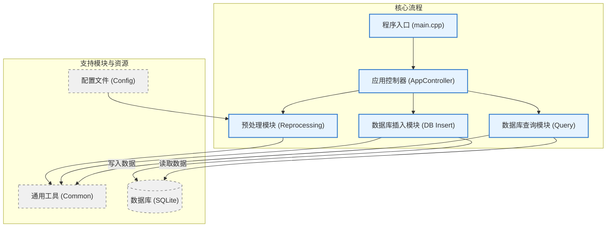

# 依赖项 (Dependencies)

本项目依赖于以下优秀的开源库：

* **[nlohmann/json](https://github.com/nlohmann/json)**
    * **用途**: 用于项目中所有 JSON 格式数据的解析和序列化（例如加载 `Validator_Config.json` 配置文件）。
    * **许可证**: MIT License

* **[SQLite C Library](https://www.sqlite.org/index.html)**
    * **用途**: C++ 部分的代码直接使用 SQLite C API 进行数据库操作，包括打开/关闭数据库连接、执行 SQL 语句、准备和绑定参数等。
    * **许可证**: Public Domain

* **[Matplotlib](https://matplotlib.org/)**
    * **用途**: 用于生成柱状图，可视化父级支出的汇总数据。
    * **许可证**: Matplotlib License (BSD-style)

# 1 Bills_Master
## 1.1 目录结构
```
Bills_Master/
├── main.cpp                              # 应用程序的交互式菜单主程序入口
├── main_command.cpp                      # 应用程序的命令行接口主程序入口
├── build.sh                              # 用于编译和构建项目的 Shell 脚本
├── CMakeLists.txt                        
│
├── app_controller/                       # 应用程序控制器模块，负责协调各个功能模块，处理用户请求
│   ├── AppController.cpp                 # AppController 类的实现，包含业务逻辑
│   ├── AppController.h                   # AppController 类的头文件，定义了应用程序的核心接口
│   └── ProcessStats.h                    # 用于跟踪和汇总处理操作（成功/失败）的统计数据结构
│
├── common/                               # 通用工具和定义，供整个项目共享
│   ├── common_utils.h                    # 包含通用工具函数和宏定义，如控制台颜色代码
│   └── version.h                         # 定义应用程序的版本信息
│
├── config/                               # 存放应用程序的配置文件
│   ├── Modifier_Config.json              # 账单修改器的配置，定义修改规则和格式化设置
│   └── Validator_Config.json             # 账单验证器的配置，定义账单分类和验证规则
│
├── db_insert/                            # 数据库插入模块，处理账单数据到 SQLite 数据库的导入
│   ├── DataProcessor.cpp                 # DataProcessor 类的实现，协调账单解析和数据库插入
│   ├── DataProcessor.h                   # DataProcessor 类的头文件
│   ├── bill_structures/                  # 数据库插入模块的数据结构定义
│   │   └── BillStructures.h              # 定义了用于数据库插入的账单相关数据结构（如 Transaction, ParsedBill）
│   ├── insertor/                         # 数据库插入器
│   │   ├── BillInserter.cpp              # BillInserter 类的实现，处理数据库连接和数据插入操作
│   │   └── BillInserter.h                # BillInserter 类的头文件
│   └── parser/                           # 账单解析器
│       ├── BillParser.cpp                # BillParser 类的实现，负责解析原始账单文件
│       └── BillParser.h                  # BillParser 类的头文件
│
├── file_handler/                         # 文件处理模块，用于查找和管理文件
│   ├── FileHandler.cpp                   # FileHandler 类的实现，包含文件查找逻辑
│   └── FileHandler.h                     # FileHandler 类的头文件
│
├── query/                         # 查询和报告模块，用于从数据库查询数据并生成报告
│   ├── QueryDb.cpp                # QueryFacade 类的实现，作为数据库查询的门面
│   ├── QueryDb.h                  # QueryFacade 类的头文件
│   ├── ReportFormat.h             # 定义报告的输出格式类型枚举（Markdown, LaTeX, Typst）
│   ├── export/                    # 导出报告
│   │   ├── ReportExporter.cpp     # 
│   │   └── ReportExporter.h       
│   ├── month/ # 月度报告相关文件
│   │   ├── MonthlyReportGenerator.cpp # 封装
│   │   ├── MonthlyReportGenerator.h   # 封装
│   │   ├── _month_data/           # 月度报告数据结构
│   │   │   └── ReportData.h       # 定义了月度报告所需的数据结构
│   │   ├── month_format/          # 月度报告格式化器接口及实现
│   │   │   ├── month_md/
│   │   │   │   ├── MonthMdFormat.cpp  # 月度 Markdown 报告格式化
│   │   │   │   └── MonthMdFormat.h 
│   │   │   ├── month_tex/
│   │   │   │   ├── MonthMdFormat.cpp  # 月度 LaTeX 报告格式化
│   │   │   │   └── MonthMdFormat.h 
│   │   │   └── month_typ/
│   │   │       ├── MonthTypFormat.cpp  # 月度 Tpyst 报告格式化
│   │   │       └──MonthTypFormat.h 
│   │   └── month_query/           # 月度查询器
│   │       ├── MonthQuery.cpp     # MonthQuery 类的实现，从数据库读取月度数据
│   │       └── MonthQuery.h       # MonthQuery 类的头文件
│   │
│   └── year/                      # 年度报告相关文件
│       ├── YearlyReportGenerator.cpp # 封装
│       ├── YearlyReportGenerator.h # YearlyReportGenerator 类的头文件
│       ├── _year_data/            # 年度报告数据结构
│       │   └── YearlyReportData.h # 定义了年度报告所需的数据结构
│       ├── year_format/           # 年度报告格式化器
│       │   ├── YearMdFormat.cpp   # 年度 Markdown 报告格式化器的实现
│       │   ├── YearMdFormat.h     # 年度 Markdown 报告格式化器的头文件
│       │   ├── YearTexFormat.cpp  # 年度 LaTeX 报告格式化器的实现
│       │   ├── YearTexFormat.h    # 年度 LaTeX 报告格式化器的头文件
│       │   ├── YearTypFormat.cpp  # 年度 Typst 报告格式化器的实现
│       │   └── YearTypFormat.h    # 年度 Typst 报告格式化器的头文件
│       └── year_query/            # 年度查询器
│           ├── YearlyDataReader.cpp # YearlyDataReader 类的实现，从数据库读取年度数据
│           └── YearlyDataReader.h # YearlyDataReader 类的头文件
│   
└── reprocessing/                         # 预处理模块，包含账单的验证和修改功能
    ├── Reprocessor.cpp                   # Reprocessor 类的实现，封装了验证和修改的流程
    ├── Reprocessor.h                     # Reprocessor 类的头文件
    ├── modifier/                         # 账单修改器
    │   ├── BillModifier.cpp              # BillModifier 类的实现，根据配置修改账单内容
    │   ├── BillModifier.h                # BillModifier 类的头文件
    │   ├── _shared_structures/           # 修改器模块共享的数据结构定义
    │   │   └── BillDataStructures.h      # 定义了账单处理中使用的通用数据结构（如 Config, ParentItem）
    │   ├── config_loader/                # 配置加载器
    │   │   ├── ConfigLoader.cpp          # ConfigLoader 类的实现，用于从 JSON 加载配置
    │   │   └── ConfigLoader.h            # ConfigLoader 类的头文件
    │   ├── processor/                    # 账单处理器（修改逻辑）
    │   │   ├── BillProcessor.cpp         # BillProcessor 类的实现，执行账单内容的具体修改操作
    │   │   └── BillProcessor.h           # BillProcessor 类的头文件
    │   └── raw_format/                   # 原始格式化器
    │       ├── BillFormatter.cpp         # BillFormatter 类的实现，将结构化数据格式化为原始账单文本
    │       └── BillFormatter.h           # BillFormatter 类的头文件
    └── validator/                        # 账单验证器
        ├── BillConfig.cpp                # BillConfig 类的实现，加载和管理验证配置
        ├── BillConfig.h                  # BillConfig 类的头文件
        ├── BillProcessor.cpp             # BillProcessor 类的实现，执行账单的核心验证逻辑
        ├── BillProcessor.h               # BillProcessor 类的头文件
        ├── BillValidator.cpp             # BillValidator 类的实现，作为验证过程的门面
        ├── BillValidator.h               # BillValidator 类的头文件
        ├── ValidationResult.cpp          # ValidationResult 类的实现，收集和报告验证错误与警告
        └── ValidationResult.h            # ValidationResult 类的头文件
```
## 1.2 架构图
### 1.2.1 整体


# 2 graph
## Configuration

The script reads its configuration from a `generate_report.json` file. If this file is not found or is invalid, default settings will be used.

### generate_report.json` Example:


```
{
  "font_sizes": {
    "title": 20,
    "axis_label": 14,
    "tick_label": 12,
    "bar_label": 10
  }
}
```
font_sizes: An object containing font size settings for different chart components:

title: Font size for the main chart title.主图表标题的字体大小。

axis_label: Font size for the X and Y axis labels.X 轴和 Y 轴标签的字体大小。

tick_label: Font size for the axis tick labels.坐标轴刻度标签的字体大小。

bar_label: Font size for the labels displayed on each bar (amount and percentage).显示在每个条形上的标签（金额和百分比）的字体大小。

